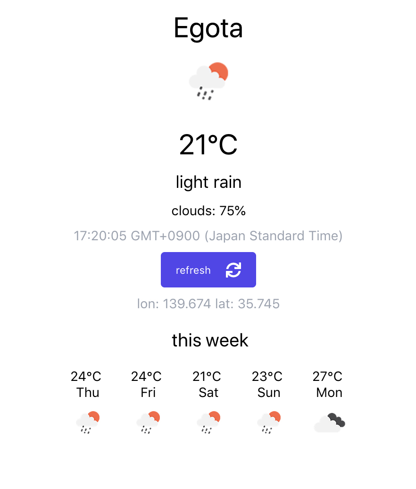

# react-native-weather-app

Very simple weather app.
Made with native react.

libraries:

- tailwind-rs : css framework
- moment : datetime handling

apis:
- open weather api

project structure (folders):
- data: backend data and requests
- widgets: react widgets (components)